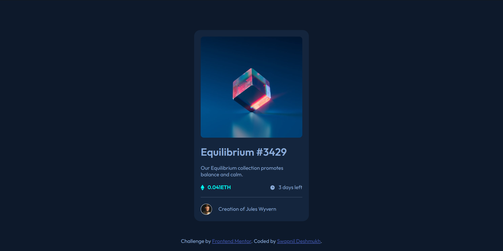
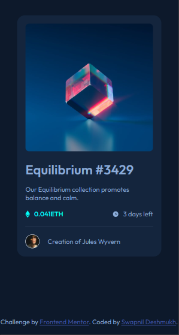

# Frontend Mentor - NFT preview card component solution

This is a solution to the [NFT preview card component challenge on Frontend Mentor](https://www.frontendmentor.io/challenges/nft-preview-card-component-SbdUL_w0U). Frontend Mentor challenges help you improve your coding skills by building realistic projects. 

## Table of contents

- [Overview](#overview)
  - [The challenge](#the-challenge)
  - [Screenshot](#screenshot)
  - [Links](#links) 
  - [Built with](#built-with) 
- [Author](#author) 
 

## Overview

### The challenge

Users should be able to:

- View the optimal layout depending on their device's screen size
- See hover states for interactive elements

### Screenshot

### Links

- Solution URL: [Link](https://github.com/swapnil-s-d/frontend_mentor/nft_preview_card/)
- Live Site URL: [Link](https://nft_preview_card_sd.netlify.app/)

## My process

### Built with

- Semantic HTML5 markup
- CSS custom properties
- Flexbox 
- [Styled Components](https://styled-components.com/) - For styles
 
## Author

- Frontend Mentor - [@swapnil-s-d](https://www.frontendmentor.io/profile/swapnil-s-d)
 